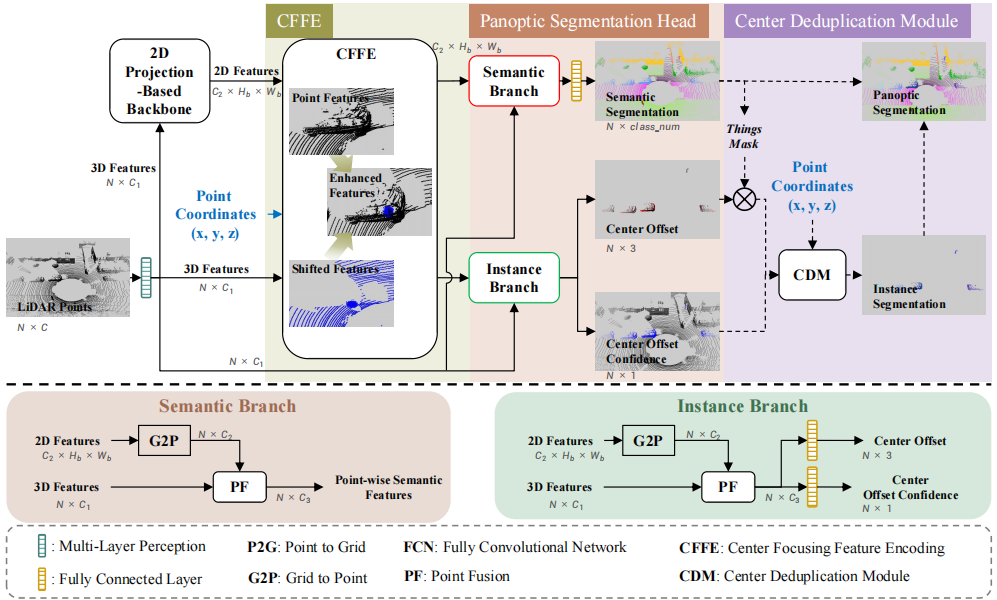
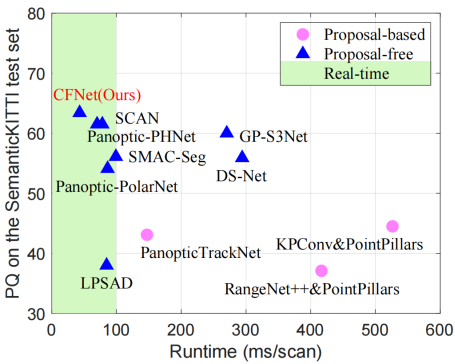

# **Center Focusing Network for Real-Time LiDAR Panoptic Segmentation**


Official code for CFNet

> **Center Focusing Network for Real-Time LiDAR Panoptic Segmentation**,
> Xiaoyan Li, Gang Zhang, Boyue Wang, Yongli Hu, Baocai Yin. (https://openaccess.thecvf.com/content/CVPR2023/papers/Li_Center_Focusing_Network_for_Real-Time_LiDAR_Panoptic_Segmentation_CVPR_2023_paper.pdf)
> *Accepted by CVPR2023*

## NEWS

- [2023-02-24] CFNet is accepted by **CVPR 2023**
- [2022-11-17] CFNet achieves the **63.4 PQ** and **68.3 mIoU** on the SemanticKITTI LiDAR Panoptic Segmentation Benchmark with the inference latency of **43.5 ms** on a single NVIDIA RTX 3090 GPU.


#### 1 Dependency

```bash
CUDA>=11.1
Pytorch>=1.10.0
PyYAML>=6.0.0
scipy

pip3 install -r requirements.txt
```

#### 2 Training Process

##### 2.1 Installation

```bash
cd pytorch_lib
python setup.py install
```

##### 2.2 Prepare Dataset

Please download the [SemanticKITTI](http://www.semantic-kitti.org/dataset.html#overview) dataset to the folder `./data` and the structure of the folder should look like:

```
./data
    ├── SemanticKITTI
        ├── ...
        └── dataset/
            ├──sequences
                ├── 00/         
                │   ├── velodyne/
                |   |	├── 000000.bin
                |   |	├── 000001.bin
                |   |	└── ...
                │   └── labels/ 
                |       ├── 000000.label
                |       ├── 000001.label
                |       └── ...
                ├── 08/ # for validation
                ├── 11/ # 11-21 for testing
                └── 21/
                    └── ...
```

And download the [object bank](https://drive.google.com/file/d/1QdSpkMLixvKQL6QPircbDI_0-GlGwsdj/view?usp=sharing) on the SemanticKITTI to the folder `./data` and the structure of the folder should look like:

```
./data
    ├── object_bank_semkitti
        ├── bicycle
        ├── bicyclist
        ├── car
        ├── motorcycle
        ├── motorcyclist
        ├── other-vehicle
        ├── person
        ├── truck
```

##### 2.3 Training Script

```bash
torchrun --nproc_per_node=8 train.py --config config/semantickitti/config_mvfcev2ctx_adam_wce_lossv2_single.py --precision "fp32"
```

#### 3 Evaluate Process

```bash
torchrun --nproc_per_node=8 evaluate.py --config config/semantickitti/config_mvfcev2ctx_adam_wce_lossv2_single.py --precision "fp32" --resume_ckpt ${model_path}
```


## Citations
```bash
@inproceedings{licfnet2023,
  author={Li, Xiaoyan and Zhang, Gang and Wang, Boyue and Hu, Yongli and Yin, Baocai},
  booktitle={2023 IEEE/CVF Conference on Computer Vision and Pattern Recognition (CVPR)}, 
  title={Center Focusing Network for Real-Time LiDAR Panoptic Segmentation}, 
  year={2023},
  volume={},
  number={},
  pages={13425-13434},
  doi={10.1109/CVPR52729.2023.01290}
}
```